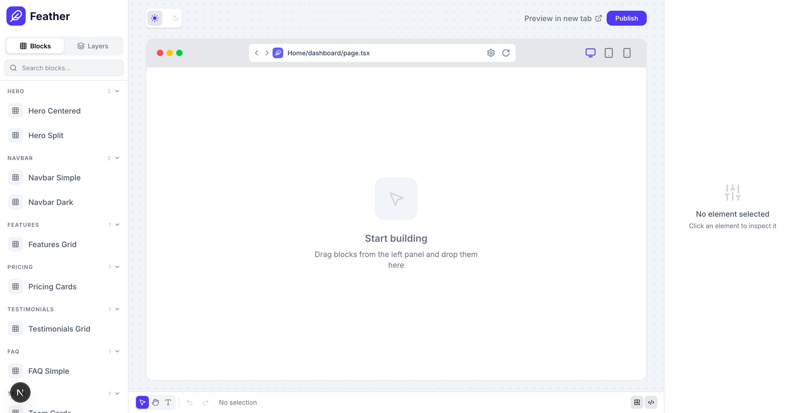

# Next.js Editor

A modern and high-performance web editor built using Next.js and React.  
This project focuses on delivering a fast, scalable, and responsive editing experience with clean UI/UX and optimized frontend architecture.

---

## 🚀 Features

- ⚡ Built with Next.js for optimized performance
- 🎨 Modern and responsive UI
- 📝 Rich text editing experience
- 🔄 Real-time updates and preview
- 📱 Mobile-friendly responsive layout
- 🧩 Reusable React components
- 🌙 Clean and scalable project structure
- 🚀 SEO optimized
- 🎯 Fast page rendering and routing
- 🎨 Styled using Tailwind CSS / Bootstrap

---

## 🛠️ Tech Stack

- Next.js
- React.js
- JavaScript / TypeScript
- Tailwind CSS / Bootstrap
- HTML5 & CSS3
- REST API Integration
- Git & GitHub

---

## 📂 Project Structure

```bash
├── components
├── pages
├── public
├── styles
├── utils
├── hooks
├── services
└── package.json
```

---

## Getting Started

First, run the development server:

```bash
npm run dev
# or
yarn dev
# or
pnpm dev
# or
bun dev
```

Open [http://localhost:3000](http://localhost:3000) with your browser to see the result.

You can start editing the page by modifying `app/page.tsx`. The page auto-updates as you edit the file.

This project uses [`next/font`](https://nextjs.org/docs/app/building-your-application/optimizing/fonts) to automatically optimize and load [Geist](https://vercel.com/font), a new font family for Vercel.

## Learn More

To learn more about Next.js, take a look at the following resources:

- [Next.js Documentation](https://nextjs.org/docs) - learn about Next.js features and API.
- [Learn Next.js](https://nextjs.org/learn) - an interactive Next.js tutorial.

You can check out [the Next.js GitHub repository](https://github.com/vercel/next.js) - your feedback and contributions are welcome!

## Deploy on Vercel

The easiest way to deploy your Next.js app is to use the [Vercel Platform](https://vercel.com/new?utm_medium=default-template&filter=next.js&utm_source=create-next-app&utm_campaign=create-next-app-readme) from the creators of Next.js.

Check out our [Next.js deployment documentation](https://nextjs.org/docs/app/building-your-application/deploying) for more details.
```

---

## 📸 Screenshots

### Home Page


### Dashboard


### Mobile View


---

## 🌐 Live Demo

Add your live project link here.

Example:

```bash
https://your-live-demo-url.com
```

---

## 📈 Performance

- Optimized rendering using Next.js
- Reusable and maintainable components
- Clean architecture for scalability
- SEO-friendly implementation
- Fast loading experience

---

## 🤝 Contributing

Contributions, issues, and feature requests are welcome.

Feel free to fork this repository and submit pull requests.

---

## 📄 License

This project is licensed under the MIT License.

---

## 👨‍💻 Author

Developed by Ravi Gupta

- GitHub: https://github.com/officialRaviG
- Portfolio: https://officialravig.github.io/row-full/
